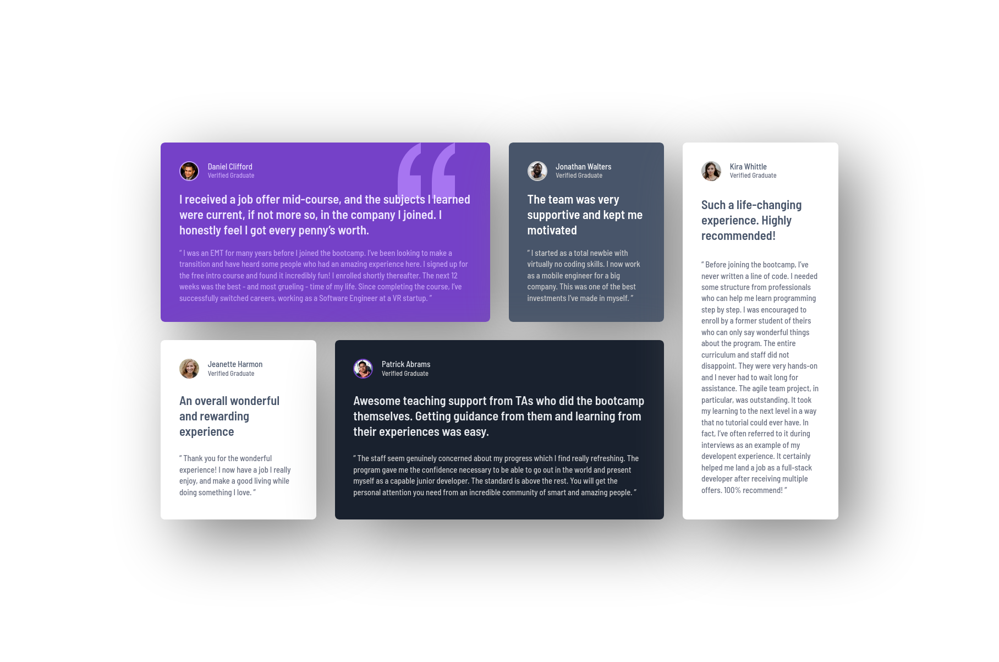

# Frontend Mentor - Testimonials grid section solution

This is a solution to the [Testimonials grid section challenge on Frontend Mentor](https://www.frontendmentor.io/challenges/testimonials-grid-section-Nnw6J7Un7). Frontend Mentor challenges help you improve your coding skills by building realistic projects. 

## Table of contents

- [Overview](#overview)
  - [The challenge](#the-challenge)
  - [Screenshot](#screenshot)
  - [Links](#links)
- [My process](#my-process)
  - [Built with](#built-with)
  - [What I learned](#what-i-learned)
  - [Continued development](#continued-development)
  - [Useful resources](#useful-resources)
- [Author](#author)
- [Acknowledgments](#acknowledgments)

## Overview

### The challenge

Users should be able to:

- View the optimal layout for the site depending on their device's screen size

### Screenshot



### Links

- Solution URL: [solution](https://github.com/ADR-39/testimonials-grid-section)
- Live Site URL: [live](https://adr-39.github.io/testimonials-grid-section/)

## My process

### Built with
- vanilla css

### What I learned
To position relative to parent:
```css
#parent {
  position: relative;
}

#child {
  position: absolute;
  right: value;
}
```

> `absolute` positions relative to the document, unless the parent is `relative`

### Useful resources

## Author
## Acknowledgments